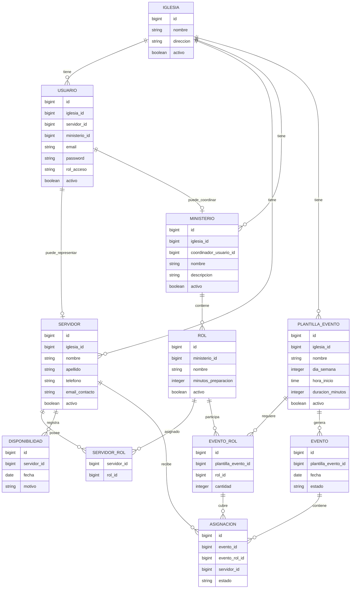

# Entity Relationship Diagram

Este documento define el modelo conceptual del sistema **Coordina**.
No describe todavía la implementación en Laravel ni el diseño físico de la base de datos.
Su objetivo es dejar claras las entidades principales y cómo se relacionan.

## Diagrama Mermaid

## Definición de entidades

### Iglesia

Entidad raíz del sistema.
Toda la información pertenece a una iglesia específica y no se comparte con otras iglesias.

### Usuario

Cuenta de acceso al sistema.
Puede existir sin estar asociada a un servidor.

### Servidor

Persona que presta servicio dentro de la iglesia.
Puede tener múltiples roles, disponibilidad y usuario asociado opcional.

### Ministerio

Área de servicio dentro de una iglesia.
Ejemplos: Multimedia, Audio, Alabanza.

### Rol

Función que puede cumplir un servidor.
Cada rol pertenece a un único ministerio.

### PlantillaEvento

Define un evento recurrente.
Ejemplo: “Culto domingo 19:00”.

### EventoRol

Define qué rol necesita una plantilla de evento y cuántas personas requiere.
Ejemplo: Cámara x2, Sonido x1, OBS x1.

### Evento

Representa una fecha concreta generada desde una plantilla de evento.

### Asignacion

Relaciona un servidor con un rol requerido dentro de un evento.
Representa que ese servidor cubre ese rol en esa fecha.

### Disponibilidad

Representa una fecha en la que un servidor no puede servir.

## Reglas importantes

* Toda la información pertenece a una iglesia.
* Un servidor puede tener múltiples roles.
* Un rol pertenece a un único ministerio.
* Un evento puede involucrar varios ministerios indirectamente mediante sus roles.
* Un servidor no puede tener más de una asignación dentro del mismo evento.
* Las asignaciones conservan historial.
* Las entidades no se eliminan físicamente; se desactivan.
* Un usuario puede estar asociado a un servidor, pero no es obligatorio.
* Un usuario también puede ser coordinador de un ministerio.
